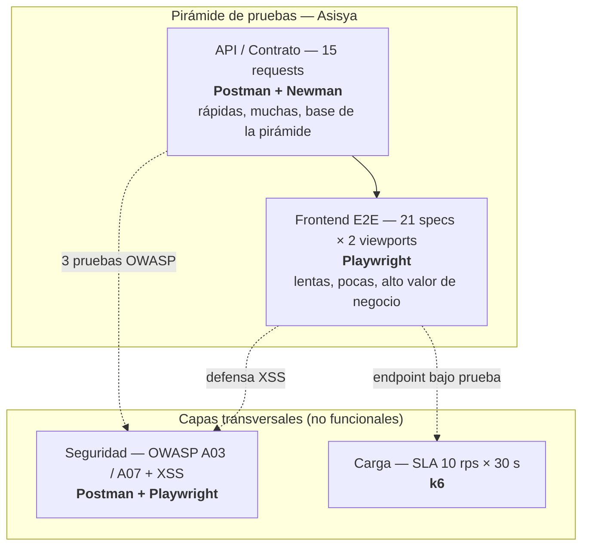

# Estrategia de pruebas — Asisya

**Prueba Técnica Ingeniero QA · Asisya**

Vista general de cómo se distribuye la automatización de este repositorio: una pirámide de pruebas
(base amplia y rápida, punta angosta y costosa) más dos capas transversales que no encajan en la
pirámide clásica porque no prueban funcionalidad, sino atributos de calidad no funcionales — carga y
seguridad — y por eso cruzan varios niveles a la vez.

## Las 4 capas y su herramienta

| Capa | Qué prueba | Herramienta | Dónde vive |
|---|---|---|---|
| **Frontend** | Los 4 puntos de la Sección B1: ingreso, estado en tiempo real, profesional asignado, XSS | Playwright (`chromium-desktop` + `mobile-chrome`) | `tests/e2e/*.spec.ts` |
| **API** | El contrato completo de la sección 3 del SDD: autenticación, solicitud de asistencia, seguimiento | Postman + Newman | `tests/api/Asisya.postman_collection.json` |
| **Carga** | SLA de `/api/asisya/seguimiento` bajo tráfico sostenido, normal vs degradado | k6 (`constant-arrival-rate`) | `perf/seguimiento-sla.js` |
| **Seguridad** | 3 pruebas OWASP (enumeración de usuarios, inyección SQL, fuerza bruta) + XSS reflejado | Postman (API) + Playwright (frontend) | Ver `docs/seccion-d-estrategia.md`, sección 6 |

## Por qué la pirámide se ve así en este proyecto

- **Base ancha en API, no en unitarias.** El sandbox no tiene lógica de negocio compleja que
  justifique una capa de pruebas unitarias separada (es un servidor Express delgado sobre un `Map` en
  memoria); el contrato de API cumple el rol de la base de la pirámide: rápida, barata, y es la que
  primero detecta una regresión de contrato.
- **E2E deliberadamente acotado a los 4 puntos exigidos.** Cada spec de frontend tiene un costo de
  mantenimiento mayor (selectores de UI, timing, video/trace); por eso son menos y se concentran en
  flujos de negocio completos (CA-01 a CA-05), no en repetir validaciones que la API ya cubre más barato.
- **Carga y seguridad no escalan con la pirámide.** No tiene sentido "más pruebas de carga que de API":
  una sola corrida de 30 s ya certifica el SLA; por eso se dibujan como capas transversales, no como un
  cuarto nivel de la pirámide.
